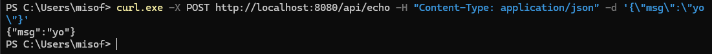
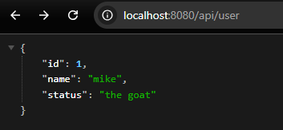
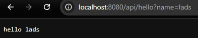

# cpp_web
c++ website just for the shits and giggles

website built with a language meant to control nuclear plants btw

---

## New version

 
 
 

How to use?
1. build it using `g++ main.cpp -std=c++17 -pthread -lws2_32`
2. test in browser
   - `localhost:8080/api/user`
   - `localhost:8080/api/hello?name=lads`
3. test in powershell
   - `curl.exe -X POST http://localhost:8080/api/echo -H "Content-Type: application/json" -d '{\"msg\":\"yo\"}'`

   hjfwhjerbuRBO3R2HOU